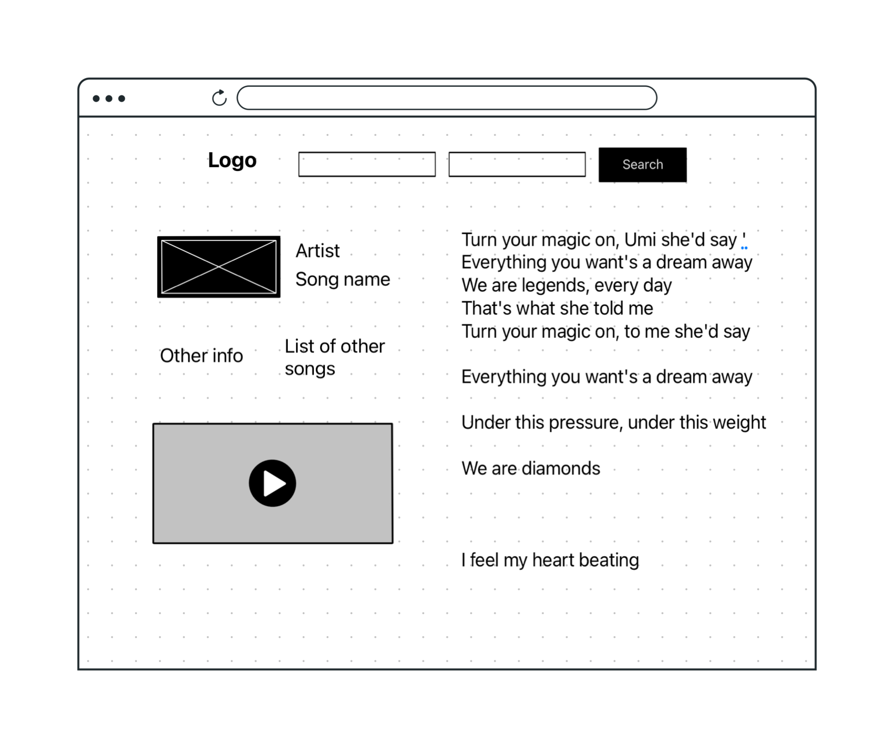

# Lyrics Finder

- Description: A simple browser app where you can search for an artist and it will display popular song results along with the lyrics.

# User Stories
As a user, I would like to search the name of an artist and in return, I would see popular song results along with the lyrics.

# Technologies Used
- HTML5
- CSS3
- Javascript
- Bulma CSS framework

# Screenshots

# Getting Started

Click [here](https://iridescent-longma-c0b7c8.netlify.app) to search for some lyrics of your favorite artists.

# Future Enhancements
- As a user, I should see some information about the artist.
- Click on a new suggeste song and replace the lyrics if available.
- Display a video of the song.
- Add loading text while it's fetching the data.
- Display error